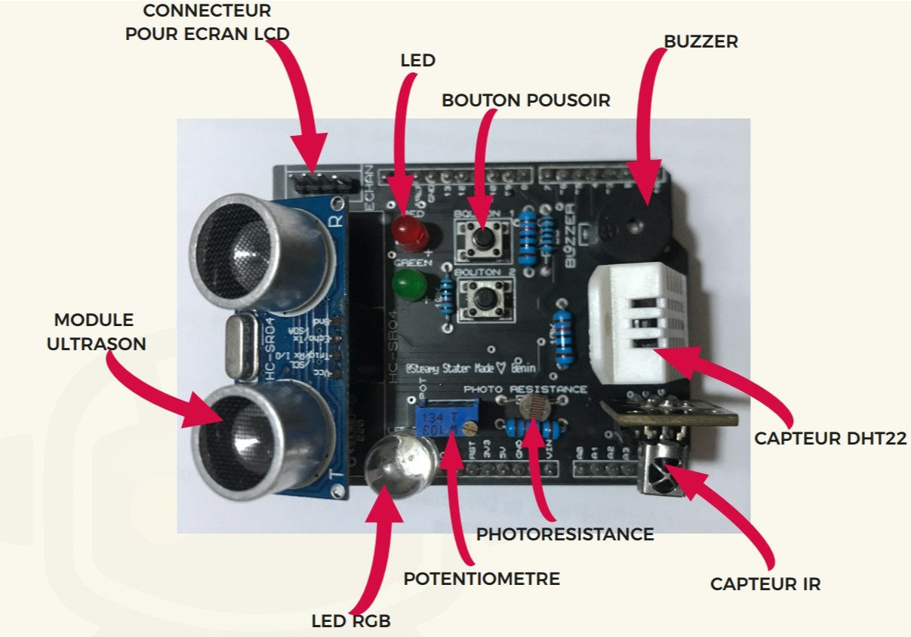
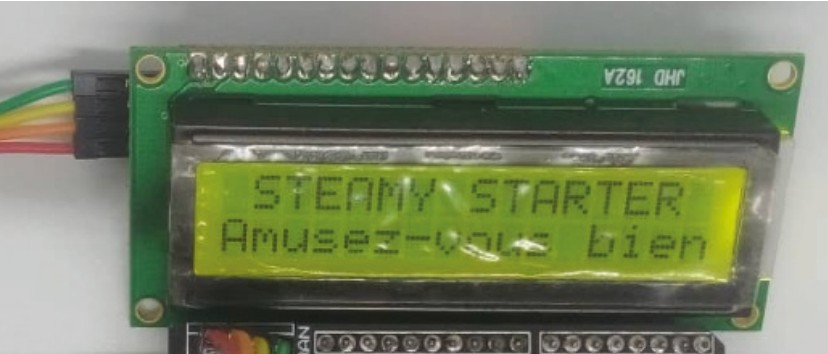
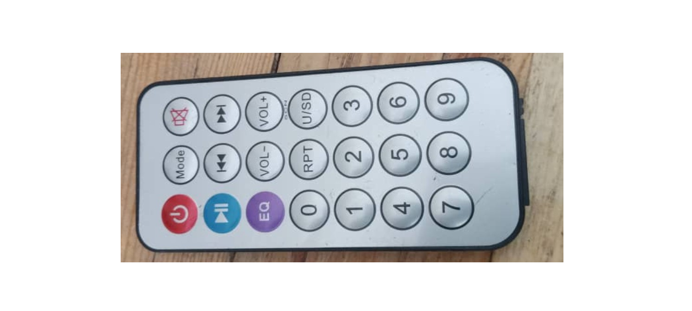
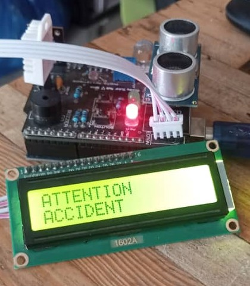
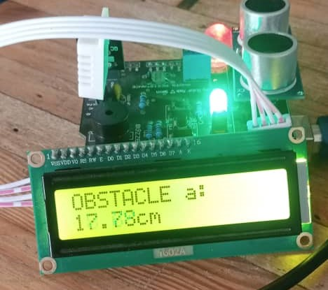

# projet-STEAMY
# proect
**PRÉSENTATION** **DU** **PROJET <u>:</u>**

> **PROJET** **STEAMY** **STARTER** Conception d'un robot contrôleur
> statique

**OBJECTIF**

> *Faire* *un* *projet* *qui* *utilise* *tout* *le* *potentiel* *du*
> *kit* *starter* *steamy.*

**FONCTIONNALITÉS** *-* *Détection* *d'obstacles*

> *-* *Système* *d'alarme* *pour* *signaler* *l'absence* *de* *lumière*
> *ou* *la* *présence* *d'eau*

>*-* *Utilisation* *de* *la* *télécommande* *infrarouge* *pour* *une*
>*alerte* *lumineuse* *à* *l'aide* *de* *la* *LED* *RGB* *dans* *le*
>*cas* *d'une* *alerte* *datant* *de* *plusieurs* *minutes*

> *-* *Contrôle* *de* *l'allumage* *et* *de* *l'extinction* *des*
> *défauts* *par* *des* *boutons-poussoirs*
>
> *-* *Alarme* *sonore* *grâce* *à* *un* *buzzer* *pour* *signaler* *un*
> *défaut* *trois* *minutes* *après* *son* *activation*  *activation*
> *des* *différents* *états* *et* *informations* *du* *système* *sur*
> *un* *écran* *LCD*
>
> *-* *Utilisation* *des* *LED* *rouges
* *et* *vertes* *pour* *signaler*
> *les* *différents* *états* *du* *robot*

**SPÉCIFICATIONS** **TECHNIQUES** 
> *-* *Langage* *:* *Arduino*
> 
> *-* *Environnement* *de* *développement* *:* *Arduino* *IDE*
> 
> *-* *Kit* *:* *STEAMY* *Starter*
> 
En apprendre plus sur le kit et son utilisation dans la [documentation officiel du kit steamy Stater](https://techitall.co)

**PLAN** **DE** **TRAVAIL** **PRÉPARATION**

> *-* *Comprendre* *les* *branchements* *et* *les* *différentes*
> *utilisations* *du* *kit* *Starter* *STEAMY* *-* *Télécharger* *les*
> *différentes* *bibliothèques* *dans* *l'éditeur* *de* *code*
>
> *-* *Effectuer* *des* *tests* *sur* *les* *équipements*
> **RÉALISATION**
>
> *-* *Effectuer* *les* *branchements*
>
> *-* *Structurer* *le* *code* *en* *différentes* *fonctions* *-*
> *Établir* *les* *liens* *entre* *les* *fonctions*
>
> *-* *Résoudre* *les* *erreurs*
 **FINALISATION**
> *-* *Tester* *le* *programme*
>
> *-* *Rédiger* *une* *documentation*

**LIVRABLES**
> *-* *Code* *source*
> 
> *-* *Rapport* *de* *projet*
>
> *-* *Prototype* *de* *robot* *contrôleur* *statique*

**<u>DOCUMENTATION DU PROJET :</u>**

**Projet** **:** ***Conception*** ***d'un*** ***robot***
***contrôleur*** ***statique***

**Objectif**

Pour des travaux spécifiques dans un laboratoire, construire un robot
contrôleur statique pour régulariser le comportement des opérateurs pour
la bonne marche des systèmes qui y sont installés

**Matériel** **Utilisé**

> \- Carte Arduino Uno
> \- Capteur de luminosité (photorésistance ou capteur de lumière
> ambiante) - Ecran LCD pour l’affichage des informations
> \- Steamy starter
> \- capteur ultrason
> \- capteur infra rouge
> \- Télécommande infrarouge
> -capteur de température et d’humidité

**Fonctionnement**

Le système fonctionne de la façon suivante :

**1.** **Démarrage** **et** **État** **du** **Système**
> \ **Bouton** **Poussoir** **BP1** **:**
> \- Appuyer sur BP1 pour démarrer le système.
>
> \- Une fois démarré, BP1 sert à acquitter les défauts après leur
> résolution.
>
> \- LED Verte : S'allume pour indiquer que le système est prêt et qu'il
> n'y a aucun problème. - LED Rouge : S'allume en cas de défaut,
> signalant un problème.

2\. **Gestion** **des** **Défauts**

>\- Si un défaut (ex. présence d'eau) est détecté, le système se met en
défaut.

>\- Pour que le système soit prêt à nouveau, le défaut doit être acquitté
en appuyant sur BP1, après avoir résolu le problème.

>\- Si le problème n'est pas résolu, l'acquittement n'est pas possible.

**3.** **allumage** **et** **redémarrage**

> \- **Bouton** **Poussoir** **BP2**

> \- Appui Simple: Redémarre le système.
> \- Appui Long: Éteint le système.

 **4.** **Gestion** **des** **Alarmes**

>\- Si un défaut n'est pas acquitté dans les 3 minutes, le buzzer
retentit pour alerter l'opérateur.

 **5.** **Détection** **d'Obstacles**
>
> **Capteur** **Ultrason****:** **Vérifie** **la** **présence** **d'****obstacles** **et** **indique** **la** **distance** avec** la** **LED** **RGB** **:**
>
> \- Rouge : Distance < 22 cm
>
> \- Orange : Distance entre 22 cm et 32 cm
>
> \- Vert : Distance entre 32 cm et 40 cm

**6.** **Télécommande** **Infrarouge**

>\- Permet de faire un jeu de lumière avec la LED RGB si le système > > est en défaut et que le buzzer a retenti pendant 1 minute sans
> acquittement
**7.** **Affichage** **sur** **Écran** **LCD** - État du Système :
>
> \- "PRÊT": Pas de défaut, LED verte allumée.
>
> \- "ATTENTION ÉLECTROCUTION" : Présence d'eau détectée.
>
> \- "OBSTACLE à X CM" : Obstacle à moins de 40 cm (X représente la
> distance). - "ATTENTION ACCIDENT" : Absence de lumière dans le
> laboratoire.

**8.** **Types** **de** **Défauts**

>\- Absence de lumière : Risque d'accident. - Présence d'eau : Risque
>d'électrocution.

**Images** **des** **composants** **utilisés**

*<u>Module steamy starter avec les différents capteurs</u>*
> 

*<u>Écran LCD_I2C</u>*

> 

*<u>Télécommande *infrarouge</u>*

>  style="width:6.98611in;height:3.14375in" />

**Code** **Arduino**
>
> Le code est structuré en plusieurs fonctions qui effectuent chaqu’un
> une action bien précise. Ces fonctions sont ensuite appelées dans
> d’autres fonctions ou appelées dans la boucle loop().

```
#include <DHT.h>
#include <IRremote.h>
#include <Wire.h>
#include <LiquidCrystal_I2C.h>

```
> Ici nous initialisons les différentes bibliothèques dont nous avons
> besoins pour l’utilisation des différents capteurs. Nous avons :
>
> \- DHT.h pour le capteur d’humidité.
>
> \- IRremote.h pour le capteur infrarouge.
>
> \- Wire.h pour la communication l2C avec l’écran LCD l2C.
>
> \- LiquidCrystal_I2C.h est utilisé pour permettre l’affichage sur
> l’écran LCD.
```
#define led_red 11
#define led_green 12
#define button_1 13
#define button_2 2 
#define potentiometre A1
#define light_sensor A0 
#define buzzer 9
#define trig_pin 7
#define echo_pin 8
#define DHTTYPE DHT22
#define DHTPIN 4
#define GRB_red 3
#define GRB_green 5
#define GRB_blue 6
#define IRpin 10
```

> Ici nous avons définis les différents pines des materieux en leur
> assigant une appellation plus pratique pour facilement les
> différencier.
```
LiquidCrystal_I2C lcd(0x27,16,2);
DHT dht(DHTPIN , DHTTYPE);
IRrecv Irrecv(IRpin);

```
> Ici nous définissons différents objets de types LiquidCrystal_I2C pour
> controler l’écran LCD, DHT pour lire les données de température et
> d’humidité et IRrecv pour recevoir les signaux infrarouge à partir de
> la télécommande.
```
bool shut_down = 0; //variable pour signaler l’arrêt du fonctionnement 
int q=1;// variable qui signale un défaut 
String error= "defaut"; //affiche un message d’erreur en cas de défaut 
 unsigned long compt_time=0;
 unsigned long total_compt_time=0;
 bool run;
```
> Ici nous définissons quelques variables qui vont etre utilisées plus
> tard dans le code.
```
float get_distance( ) {// cette fonction lis la distance grâce au capteur ultra sonic 
  digitalWrite(trig_pin, LOW);
  digitalWrite(trig_pin, HIGH);
  delay(10);
  digitalWrite(trig_pin, LOW);
  long duration = pulseIn(echo_pin, HIGH);
  float distance = (duration * 0.034)/ 2;
  return distance;
}
```
> Cette fonction get_distance permet de calculer la distance a laquelle
> se trouve un objet en fonction des valeurs de retour du capteur
> ultrason.
```
void setColor( int red_value, int green_value, int blue_value){ //modifier les couleurs de la led RGB
  analogWrite(GRB_red, red_value);
  analogWrite(GRB_green, green_value);
  analogWrite(GRB_blue, blue_value);
}

```
> La fonction setColor permet de donner une couleur a l’allumage de la
> LED GRB. Elle prends en paramètre des valeurs comprises entre 0 et 255
> pour chaque variable qu’elle prend en entrée et allume une couleur en
> fonction de la combinaison des valeurs reçues, chaque variable
> correspond a l’allumage d’une couleur.
```
bool mesDist(){  //affiche un message et allume la led RGB en fonction de la distance obtenue par le capteur ultra son 
  
    lcd.backlight();
    lcd.clear(); 
  float dist = get_distance();
  lcd.setCursor(0,0);
  if ( dist< 22){
    setColor(255, 0, 0);
    lcd.setCursor(0,0);
    lcd.print(F("OBSTACLE a:"));
    lcd.setCursor(0,11);
    lcd.print(dist);
    lcd.print(F("cm"));
    delay(500);
     }else if(dist>=22 && dist<32) {
      setColor(200, 37, 7);
      lcd.clear();
      lcd.setCursor(0,0);
      lcd.print(F("OBSTACLE a:"));
      lcd.setCursor(0,11);
      lcd.print(dist);
      lcd.print(F("cm"));
      delay(500);
     }else if( dist>=32 && dist<40){
      setColor(0, 255, 0);
      lcd.clear();
      lcd.setCursor(0,0);
      lcd.print(F("OBSTACLE a:"));
      lcd.setCursor(0,11);
      lcd.print(dist);
      lcd.print(F("cm"));
      delay(500);
      }else{
        lcd.clear();
        lcd.print(F("pret..."));
        setColor(0, 0, 0);
        } 
        return 1;
} 

```
> La fonction mesDist permet au systèlme de savoir a quelle distance se
> trouve un obstacle grace a la valeur de retour de la fonction
> get_distance et de l’afficher sur l’écrant LCD. IL permet également
> d’allumer la led GRB sur une couleur grace a la fonction setColor en
> fonction de la distance a la quelle se trouve l’obstacle.
```
void button(){ //fonction pour gérer le fonctionnement du boutton 2 pour eteindre ou redémarrer le système
  int etat_button = digitalRead(button_2);
  unsigned long dure_appuis = 0;
   unsigned long  debut_appuis = 0;
  if (etat_button == HIGH ){
    debut_appuis = millis();
      while (digitalRead(button_2) == HIGH){
       }
       dure_appuis = millis() - debut_appuis;
       delay (50);
    if (dure_appuis < 800) {
      lcd.clear();
      Serial.println("appuis court");
      digitalWrite(led_green, LOW);
      digitalWrite(led_red, LOW);
      noTone(buzzer);
    setColor(0, 0, 0);
    run = 1;
    lcd.print("redemarrage");
    delay(1000);
    runing() ;
      } else if(dure_appuis >= 800) {
    Serial.println("appuis long");
    lcd.clear();
    setColor(0, 0, 0);
    digitalWrite(led_red, LOW);
    digitalWrite(led_green,LOW);
    digitalWrite(buzzer, LOW);
    shut_down = 1;
    run=0;
    loop();
      }
    }
  }

```
> La fonction Button permet implémente le comportement du bouton_2 qui
> dois éteindre le systhème en cas d’appuis long et le redémarrer dans
> le cas d’appuis court pour fonctionner il fait appelle à différentes
> fonctions dont nous n’avons pas encore parlé
```
unsigned long  defaut_lumiere(){ //gère la detection de defaut lummineux
 int light_value= analogRead(light_sensor);
 //Serial.println(light_value);
  if(light_value < 100){
   compt_time=millis();
     q=1;
    lcd.clear();
   error = "ATTENTION ACCIDENT";
   //buzzer();
   while(q==1){
      defaut(compt_time);
    }
  }
  return compt_time;
}
```
> Cette fonction comme sont nom l’indique gère le cas du défaut de
> lumière elle fait appelle a la fonction defaut que nous verrons tt a
> l’heur pour réagire lorsque la lumière est en dessous d’un certain
> seuille.
>
> Il renvoie une sauvegarde du temps auquel le défaut s’est enclenché.
```
unsigned long  defaut_humidite(){//gère la detrection de defaut par rapport a l'humidité
  float humidite = dht.readHumidity();
  float temperature = dht.readTemperature();
  while ( isnan(humidite) || isnan(temperature)){
    lcd.clear();
    lcd.setCursor(0,0);
    lcd.print(F("capteur error..."));
  }
  lcd.clear();
  if (humidite > 80){
   compt_time= millis();
    q=1;
    lcd.clear();
    error = "ATTENTION ELECTROCUTION";
    while(q==1){
      defaut(compt_time);
     }
  }
 return compt_time;
}

```
> Cette fonction defaut_humidite fait exactement la même chose que la
> précédente main dans le cas de l’humidité.
```
void defaut(unsigned long time_var ){ //gère le comportement de l’appareil en cas de detection d'un defaut 
if (digitalRead(button_1)== HIGH && q==1 ){
  setColor(0, 0, 0);
    lcd.clear();
    lcd.setCursor(0, 0);
    String ligne_1 = error.substring(0, 10);
    lcd.print(ligne_1);
    lcd.setCursor(0, 1);
    String ligne_2 = error.substring(10);
    lcd.print(ligne_2);
    digitalWrite(led_red, HIGH);
    digitalWrite(led_green, LOW);
    delay(100);
    if ((millis()-time_var) >= 180000){
      tone(buzzer, 330);
    }
    if((millis()- time_var)>= 240){
      if ( IRcaptor()!=0 ){
        while (digitalRead(button_1)== HIGH){
        digitalRead(button_1);
        setColor( 255, 0, 0);
        delay(100);
        setColor( 0,255, 0);
        delay(100);
        setColor( 0, 0,255);
        delay(100);
        }
      }
    }
  } 
    else{
    digitalWrite(led_red, LOW);
    digitalWrite(led_green, HIGH);
    setColor(0, 0, 0);
    noTone(buzzer);
    lcd.clear();
    lcd.setCursor(0, 0);
    lcd.print(F("pret..."));
    q=0;
    }
  }

```
> La fonction defaut() ci dessus implémente le comportement du robot en
> fonction de la valeur de retour du button_1 lorsqu’un defaut est
> repéré. Il fait clignoter la led RGB lorsque l’alarme est en cour
> depuis plus 4 minutes et fait sonner le buzzer au bout de 3 minute
> après l’etat de defaut grace a la valeur de retour de la fonction
> defaut qui sexécute.
```
uint16_t IRcaptor(){ // gère la réception des signaux par le capteur infra rouge 
    uint16_t received{0};
    if(IrReceiver.decode()){
      IrReceiver.printIRResultShort(&Serial);
      if( IrReceiver.decodedIRData.protocol == UNKNOWN){
        IrReceiver.printIRResultRawFormatted(&Serial, true );
      }
      if(IrReceiver.decodedIRData.protocol== NEC){
      received = IrReceiver.decodedIRData.command;
      Serial.println(received, HEX);
      }
      IrReceiver.resume();
    }
    return received;
  }
```
> Cette fonction permet de lire le signale envoyé par la télécommande
> dans un premier temps il lis le signale et détermine si il utilise le
> protocole NEC ou pas si ce n’est pas le cas il envoie les données
> brutes du signale (le temps de signale pour chaque impulsion de l’IR )
> ce qui permet de visualiser les signaux brutes reçus. Dans le cas
> contraire il affiche le signale reçue dans le moniteur série il
> renvoie a la fin la valeur du signale reçue.
```

void runing(){
    while(run){
        
digitalWrite(led_green, HIGH);
mesDist();
defaut_lumiere();
defaut_humidite();
button();
      }
  }
```
> Cette fonction est une boucle dans laquelle est appelée certaines des
> fonctions précédentes lorsque la variable run est vrai.
```
void setup() {  
pinMode(led_green , OUTPUT);
pinMode (led_red , OUTPUT);
Serial.begin(9600);
pinMode(button_1 , INPUT);
pinMode(button_2 , INPUT);
digitalWrite(led_green , LOW);
digitalWrite(led_red , LOW);
pinMode(buzzer, OUTPUT);
pinMode(trig_pin, OUTPUT);
pinMode( echo_pin, INPUT);
pinMode(GRB_red, OUTPUT);
pinMode(GRB_blue, OUTPUT);
pinMode(GRB_green, OUTPUT);
IRrecv.enableIRIn();
lcd.init ();
lcd.backlight();
lcd.setCursor(0, 0);
lcd.print("DHT 22 test!");
dht.begin();
delay(2000);
lcd.clear();
}
```
> Il s’agit de la fonction d’initialisation setup() ou les differents
> pines sont configurées et ou les différents capteurs son initialisés.
```
void loop() {
  // appelle des differents fonctions
      if(digitalRead(button_1)== LOW){
      run=1;
      runing();
    }
  }
```
> La fonction loop() ci dessus est une boucle qui appelle la fonction
> runing() lorsque le button_1 est appuié.
>
**Résultats**
>
> Ce système permet de surveiller un environnement et émettre des
> alarmes lorsque il y a des défauts , en fonction des conditions
> ambiantes mesurées par les capteurs. Cela permet de surveiller
> efficacement l’environnement dans un laboratoire .
>
 **Améliorations** **Possibles**
>
> \- Utilisation d'un capteur de luminosité plus précis (ex : capteur de
> lumière ambiante I2C)
>
> \- Ajout d'un cas de fonctionnement ou en cas de defaut il serais
> impossible d ‘éteindre le système sans au préalable déactiver l’état
> d’alerte du robot.
>
> \- Intégration d'un module RTC (Real-Time Clock) pour une gestion plus
> fine du temps pour la stabilisation de l’affichage et pour les
> différents états de fonctionnement l’ors de l’activation de l’alerte
> défaut.
>
**Difficultés**
>
> -J’ai eu du mal lors de l’implémentation du comportement du boutton 2
> pour allumer et éteindre le robot. -J’ai aussi eu des difficultés pour
> l’alarme sonore du buzzer après trois minutes et le clignotement de la
> led GRB après 4 minutes grâce a la télécommande
>
> -J’ai également eu du mal a récupérer, a comprendre le fonctionnement
> et àfaire fonctionner la fonction de récupération du signale de la
> télécommande.
>
**Résolution** **des** **difficultés**
>
> pour résoudre mes problèmes j’ai lue la documentation sur le
> fonctionnement du capteur IR et demendé de l’aide aux intelligences
> artificielles telle que perplexity et chat gpt pour m’expliquer le
> fonctionnement des composants et trouver des algorithmes pour résoudre
> mes problèmes.
>
**Image** **du** **prototype**

 *Image* *1*
 


 *image* *2*
 



**Conclusion**

Ce projet simple et efficace permet de surveiller des environnements
sans nécessiter une forte présence humaine . Il peut être facilement
adapté à différents types de surveillance et peut être amélioré avec des
fonctionnalités supplémentaires selon les besoins et les moyens.
